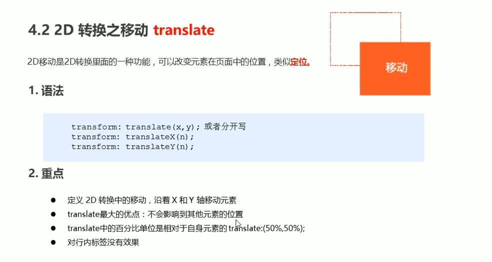
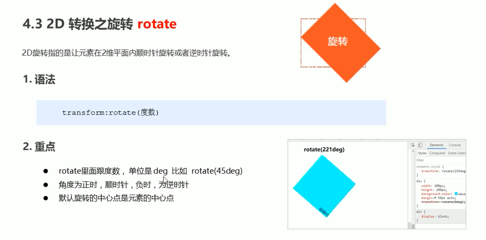
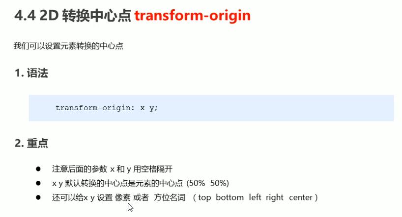
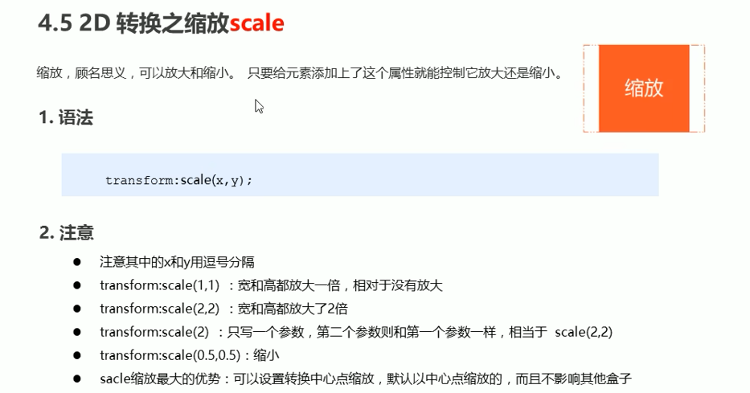
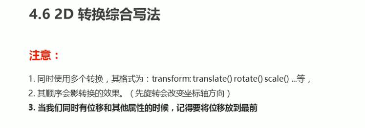
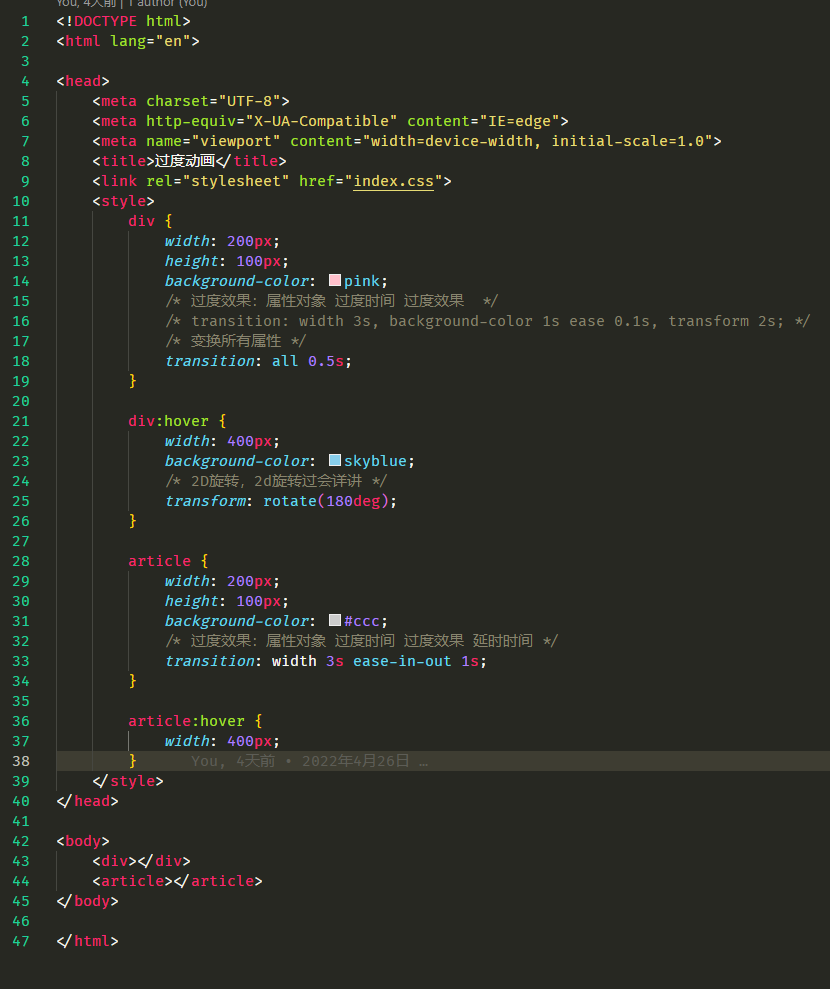
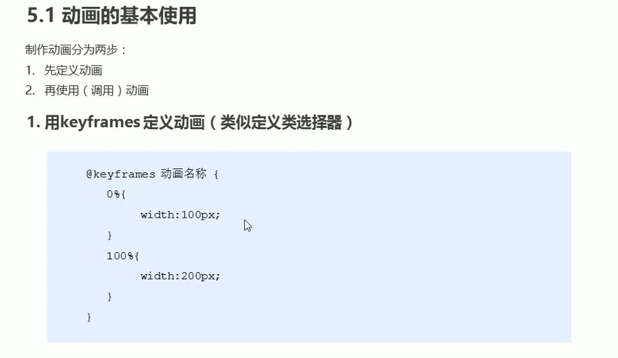
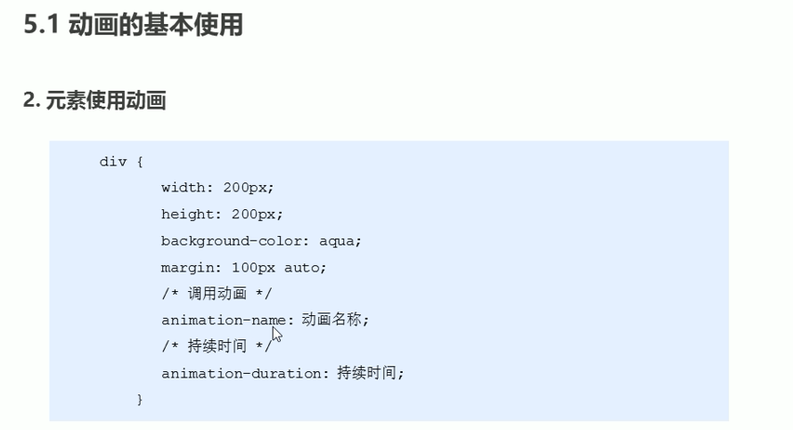
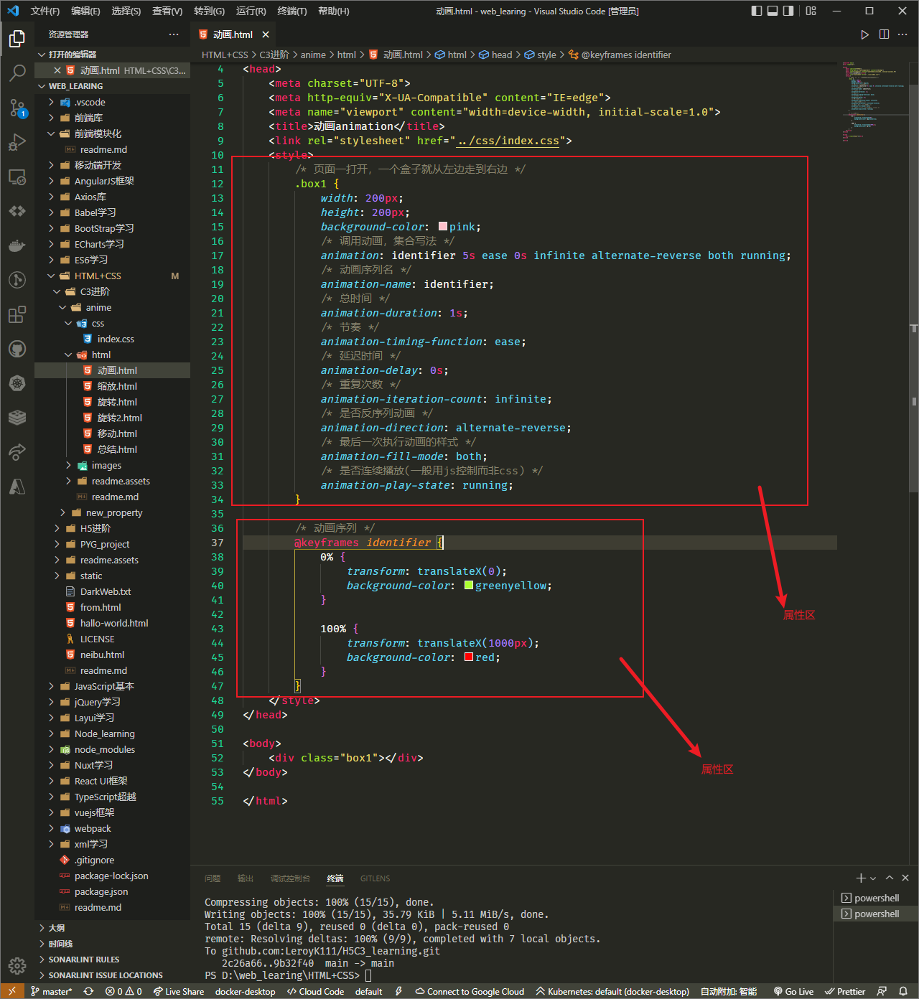
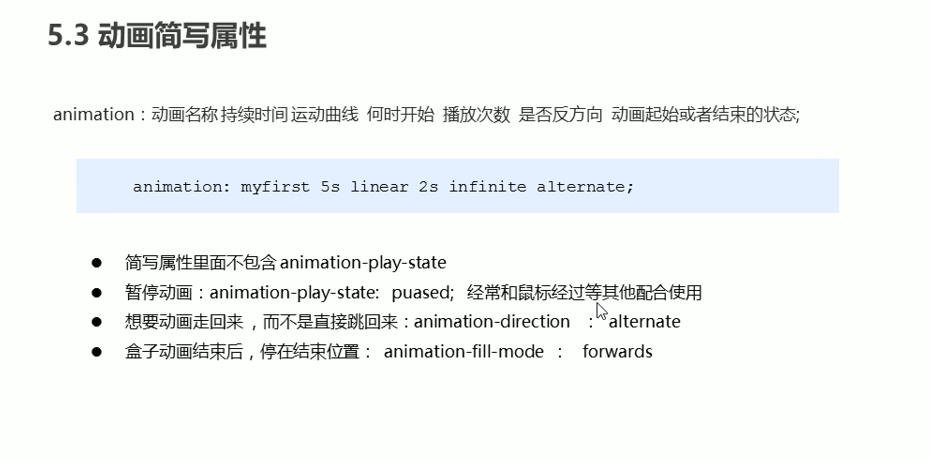

# CSS3的高级动画

## 伪类

## 

## 2D转换（transform）

### 转换之移动translate

### 转换之旋转rotate

### 转换之缩放scale

### 总结

## CSS3动画

### **过度**

使用hover伪类触发transition过度效果。

过度只能用来玩玩。

### ★动画animation

#### 定义每帧的动画

#### 使用动画

究极的案例

## 3D转换