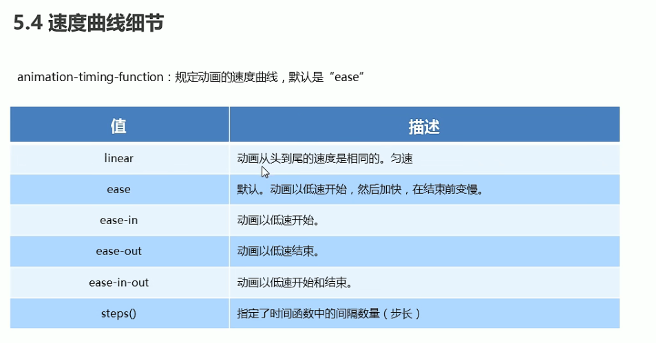
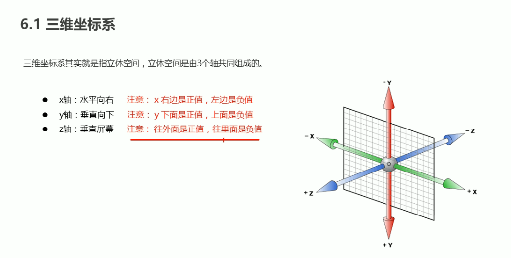
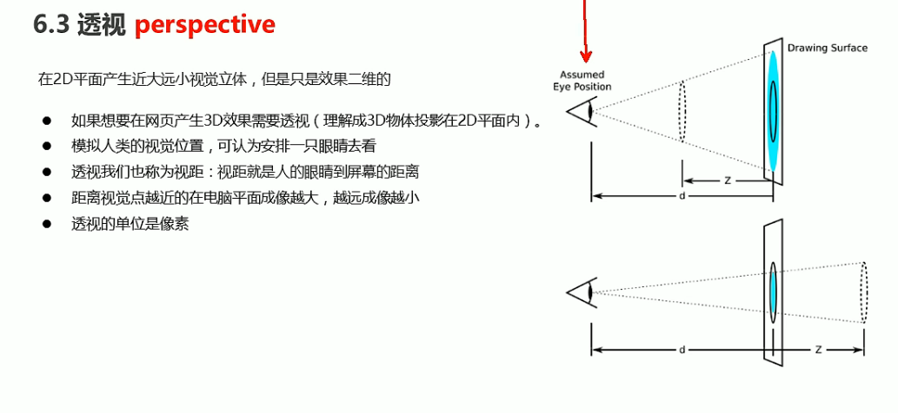
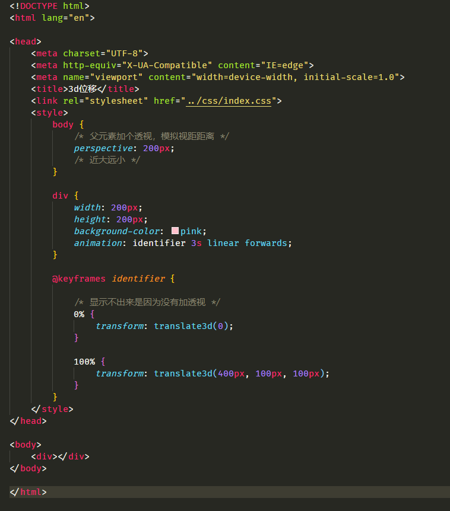
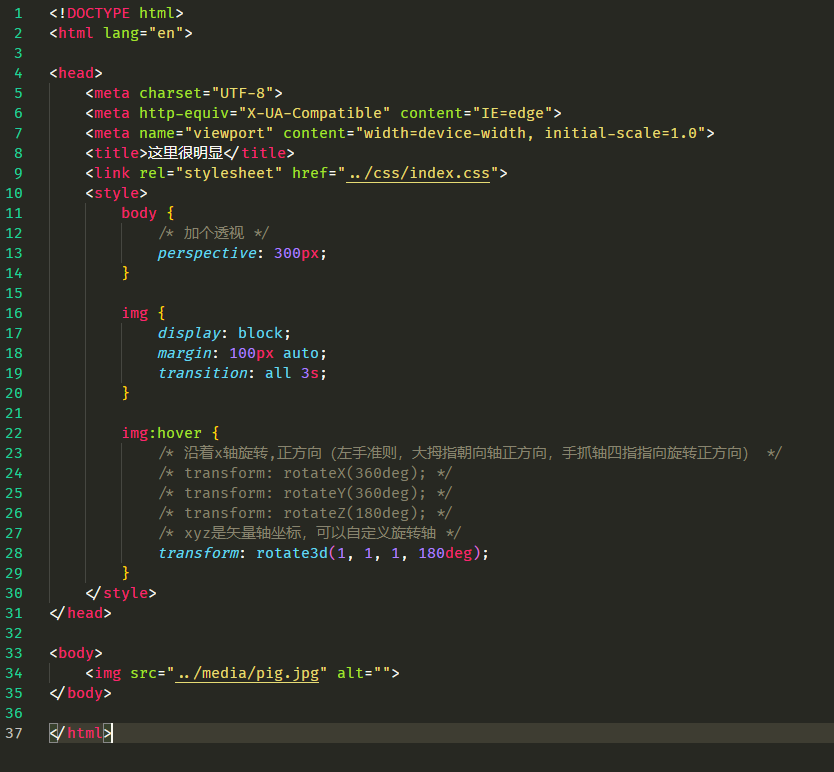
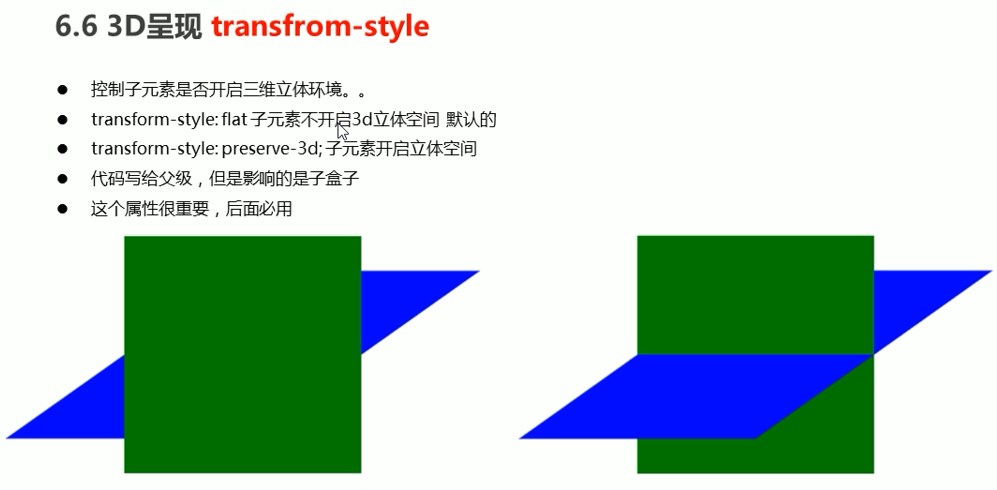
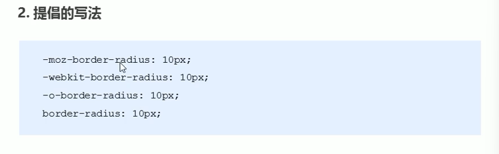

# CSS3的高级动画

## 伪类

## 2D转换（transform）

### 转换之移动translate

### 转换之旋转rotate

### 转换之缩放scale

### 总结

## CSS3动画

### **过度**

使用hover伪类触发transition过度效果。

过度只能用来玩玩。

### ★动画animation

#### 定义每帧的动画

#### 使用动画

究极的案例

可以自由设置步长

## 3D转换

### 透视persoective

### 移动translate3d

### 旋转rotate3d

### 呈现transfrom-style

这是一个3d反转效果，需要先给盒子添加厚度

## 私有前缀

为了满足兼容性

