# 深入了解HTTP协议

## request请求行view parsed

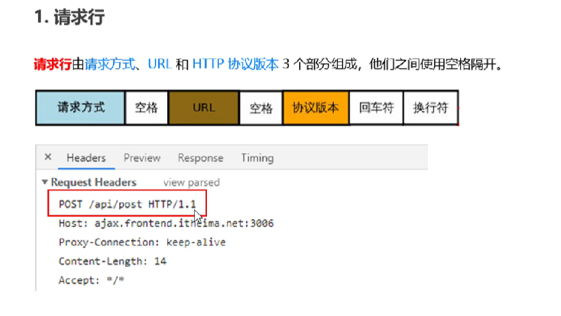

### 请求头部header

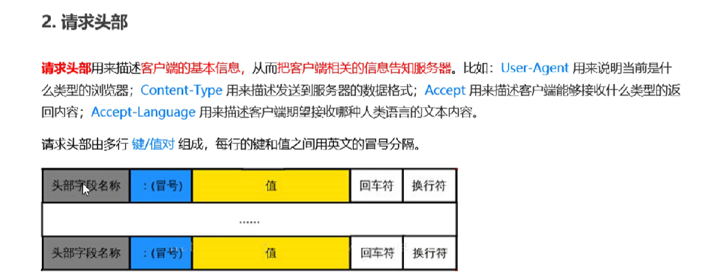

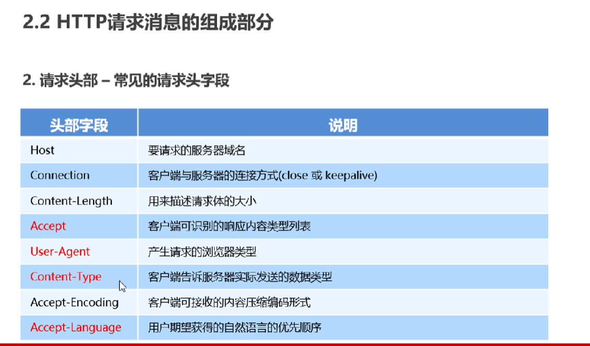

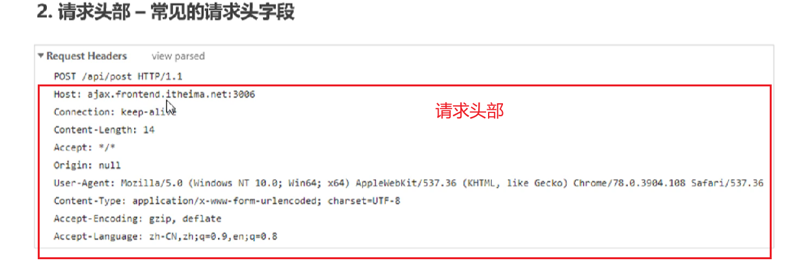

### 空行（没啥意义）

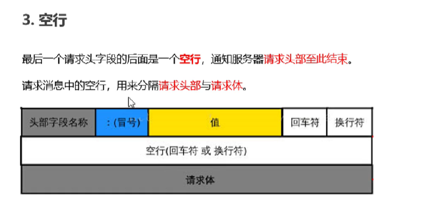

### 请求体BODY

get没有请求体

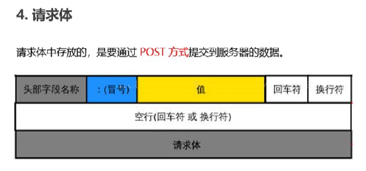

## response状态

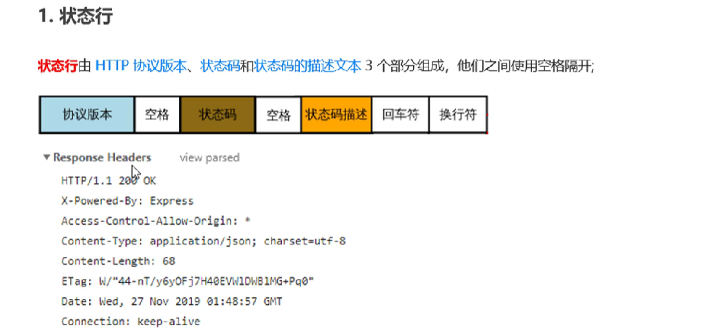

### 响应头部headers

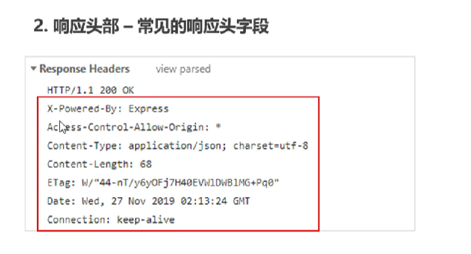

### 空行

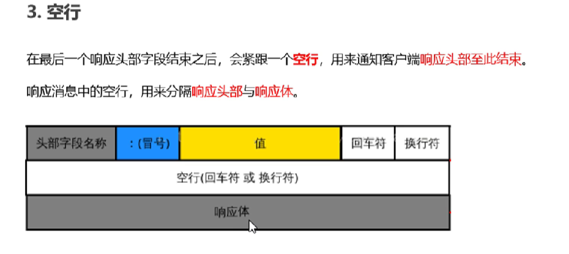

### 响应体

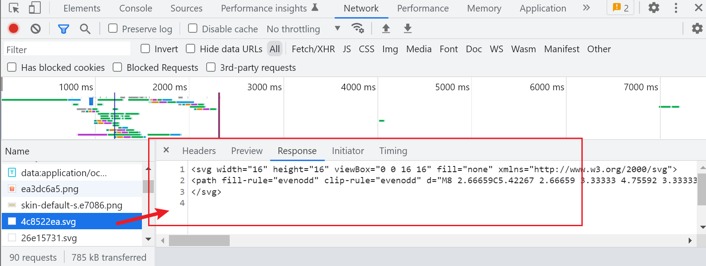

## HTTP请求方法

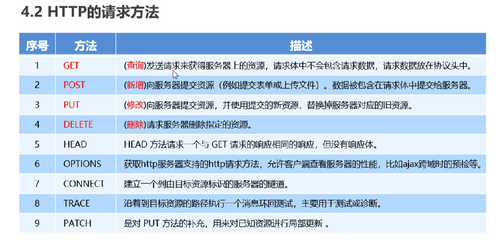

## 响应状态码

https://developer.mozilla.org/zh-CN/docs/Web/HTTP/Status

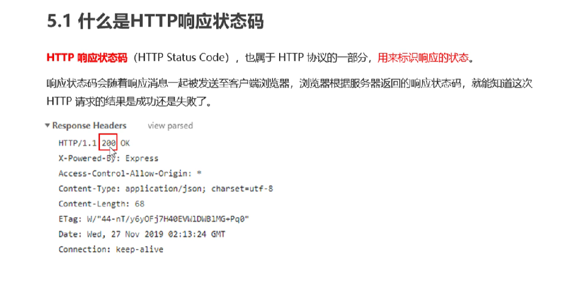